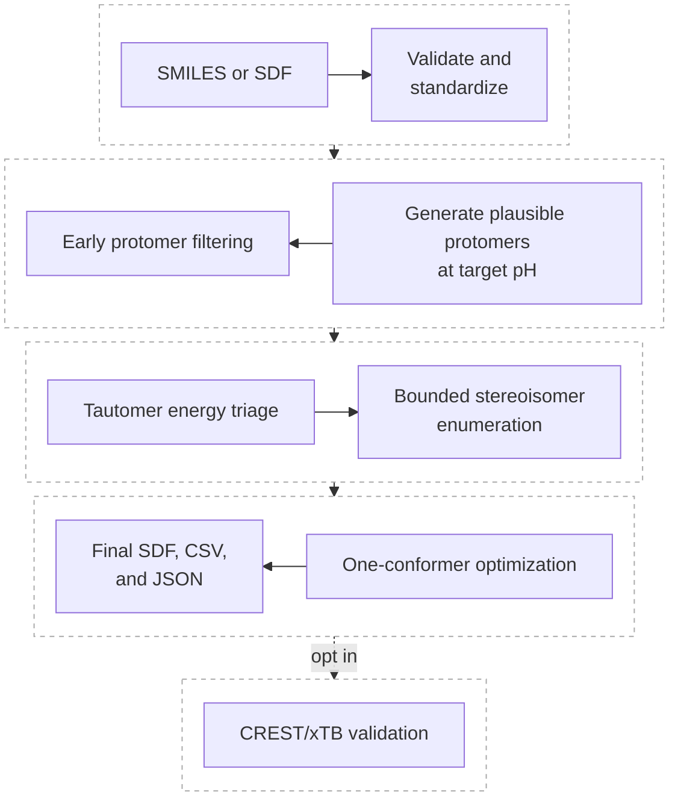

# Dominant Structural Variant Ranker

`dominant-structural-variant-ranker` (`dsvr`) is a Python orchestration package for preparing and ranking pH- and solvent-dependent small-molecule structural variants with maintained open-source tools.

This repository is a wrapper/orchestrator. It does **not** vendor, mirror, or clone third-party repositories. RDKit, molscrub, Auto3D, xTB, CREST, CENSO, Psi4, and PySCF remain external tools installed through uv, official binary distributions, or user-managed software modules.

## Default Workflow

The recommended default is a bounded plausible-variant ligand-preparation workflow for docking, ligand-based modeling, and batch-library preparation. It covers a role similar to a LigPrep workflow while using open-source components and DSVR's explicit limits and provenance.



Start with:

```bash
dsvr prepare-ligands examples/test_molecules.smi \
  --ph 7.0 \
  --solvent water \
  --out runs/ligprep_like_water_pH7
```

The old CREST/xTB-centered workflow is expensive and optional. Use `configs/physics_validation_optional.yaml` or `configs/physics_heavy.yaml` only for selected validation/refinement runs after the candidate set is small. `configs/exhaustive_debug.yaml` remains useful for small-molecule debugging, but it is intentionally expensive.

## Auto3D Energy Triage

RDKit alone can enumerate too many tautomers and does not rank tautomer abundance. The default workflow filters tautomers before stereoisomer enumeration because expanding stereoisomers for every tautomer multiplies candidate count before any energy signal is available.

Auto3D ranking is approximate potential-energy triage. It ranks low-energy tautomer and stereoisomer candidates by optimized conformer energies, not by true solution abundance. Auto3D thermodynamics, when used, are not substitutes for validated solvated free energies.

## Scientific Warning

The default pipeline is fast ligand preparation, not an exhaustive conformational free-energy workflow. It does not perform rigorous pH-dependent population calculations, pKa prediction, or solution speciation.

CREST/xTB, xTB thermo, CREST entropy estimates, CENSO, and Psi4/PySCF rescoring are optional validation/refinement steps. Psi4/PySCF rescoring outside the default workflow should be treated as an advanced legacy module unless explicitly enabled.

## Quick Start

```bash
uv sync --extra dev
source .venv/bin/activate
dsvr doctor
dsvr prepare-ligands examples/test_molecules_minimal.smi --config configs/ligprep_like_default.yaml --out runs/smoke
```

For direct source-tree smoke checks:

```bash
PYTHONPATH=src python -m dsvr.cli --help
PYTHONPATH=src python -m pytest
```

## Dependency Strategy

- Do not vendor Third-party repositories.
- Install Python packages via uv.
- Install external binaries via official binaries or user-managed modules.
- Use `dsvr doctor` to verify the environment before running optional physics-heavy workflows.

Optional Python tools:

```bash
uv sync --extra auto3d --extra molscrub
```

## CLI

Use `dsvr prepare-ligands` for the default workflow. `dsvr run` remains available for backward-compatible workflow scripts.

```bash
python -m dsvr.cli --help
dsvr --help
dsvr doctor
dsvr inspect examples/test_molecules.smi
dsvr prepare-ligands examples/test_molecules_minimal.smi --config configs/ligprep_like_default.yaml --out runs/smoke
dsvr prepare-ligands examples/test_molecules_minimal.smi --dry-run --max-protomers 4 --tauto-k 3 --max-stereoisomers 16
```

## Documentation

- [Architecture](docs/architecture.md)
- [Workflow](docs/workflow.md)
- [Plausible variant workflow](docs/plausible_variant_workflow.md)
- [Limitations](docs/limitations.md)
- [External tools](docs/external_tools.md)
- [File formats](docs/file_formats.md)
- [Installation](docs/installation.md)

## Development

```bash
pytest
ruff check src tests
mypy src
```

For long-running checks, launch each repository-local test script in its own
`screen` session:

```bash
screen -dmS dsvr-doctor ./scripts/test_doctor.sh
screen -dmS dsvr-pytest ./scripts/test_pytest.sh
screen -dmS dsvr-auto3d ./scripts/test_auto3d_smoke.sh
screen -dmS dsvr-standard ./scripts/test_standard_protocol.sh
```

Timestamped logs are written to `logs/screen-tests/`.
