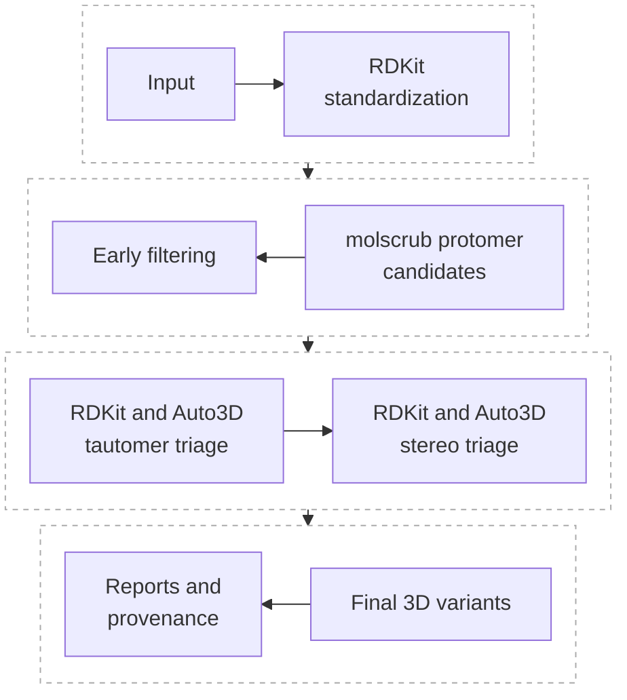

# Architecture

DSVR is a thin orchestration layer for structural-variant preparation and
optional higher-cost validation. It coordinates maintained open-source chemistry tools, records
their inputs and outputs, parses result summaries, and reports scoped rankings.
It is not a fork or vendored mirror of those tools.

## Design Principles

- Keep third-party engines external and user-installable.
- Keep import-time dependencies limited to the Python stack needed by the
  current command.
- Validate configuration and data with typed models.
- Preserve raw command logs and parsed summaries.
- Make scientific scope explicit in every ranking and population report.
- Allow restart/resume behavior around durable run directories.

## Module Responsibilities

| Module | Responsibility |
| --- | --- |
| `dsvr.config` | YAML loading and validated workflow defaults. |
| `dsvr.models` | Shared typed records for molecules, variants, tools, and workflow results. |
| `dsvr.io` | SMILES/SDF input readers and ranked output writers. |
| `dsvr.chemistry` | Standardization, identifiers, RDKit enumeration hooks, and Auto3D integration points. |
| `dsvr.runners` | Subprocess wrappers for optional external tools. |
| `dsvr.parsing` | Parsers for Auto3D, xTB, CREST, and CENSO outputs. |
| `dsvr.ranking` | Energy conversion, Boltzmann weighting, and dominance ranking. |
| `dsvr.workflow` | Step ordering, provenance, resume checks, and run engine orchestration. |
| `dsvr.reporting` | Markdown, CSV/table summaries, and user-facing reports. |
| `dsvr.utils` | Logging, paths, hashing, units, and environment/tool checks. |

## Default Workflow Architecture

The default production engine follows this sequence:

The default path uses RDKit for bounded enumeration and Auto3D energies for approximate candidate triage. CREST/xTB, CENSO, and Psi4/PySCF are separate, explicitly enabled validation or refinement layers; none is a default dependency.

## Dependency Boundaries

Core CLI and configuration code should not import optional engines at package
import time. External tools are checked through `dsvr doctor` and step-specific
runner validation.

RDKit is part of the intended core conda environment. Auto3D, molscrub, xTB,
CREST, CENSO, Psi4, and PySCF are only required when the selected workflow step
uses them.

## Scientific Boundaries

The architecture separates candidate generation from thermodynamic correction:

- molscrub provides practical pH/protomer candidates.
- RDKit tautomer canonicalization is representation canonicalization, not
  stability ranking.
- RDKit stereoisomer enumeration is explicit and controlled by configuration.
- Auto3D can seed or prefilter conformers but must not double-enumerate
  tautomers/stereoisomers unless `auto3d_internal_enumeration` is enabled.
- CREST/xTB can provide an optional physics-based validation layer.
- Boltzmann populations are only as comparable as the free energies used to
  compute them.
