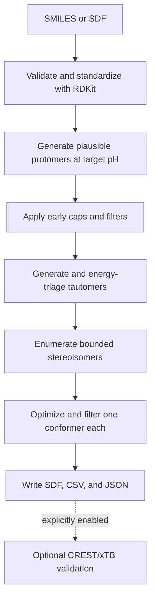

# Workflow

DSVR's default workflow is a plausible-variant ligand-preparation protocol. It serves a role similar to a LigPrep workflow, using open-source components and explicit limits. It is designed for fast preparation of ligand libraries for docking, ligand-based modeling, and batch processing, not exhaustive conformational free-energy ranking.

## Default Path



Recommended config:

```bash
dsvr run examples/test_molecules.smi   --config configs/ligprep_like_default.yaml   --outdir runs/ligprep_like_water_pH7
```

## Step Responsibilities

| Step | Tooling | Scope |
| --- | --- | --- |
| Input | DSVR readers | Read SMILES/SDF and report invalid records. |
| Standardization | RDKit | Normalize molecules and keep valid ligand inputs. |
| Protomer generation | molscrub/fallback logic | Generate plausible pH/protomer candidates at target pH. |
| Early protomer filtering | DSVR filters | Cap protomer count before tautomer work. |
| Tautomer candidate generation | RDKit via Auto3D path | Generate bounded tautomer candidates. |
| Tautomer energy triage | Auto3D ANI2xt/AIMNet2 | Rank/filter by optimized conformer energies. |
| Stereoisomer enumeration | RDKit | Enumerate after tautomer filtering with timeouts/caps. |
| Stereoisomer energy triage | Auto3D one-conformer optimization | Filter high-energy stereoisomers. |
| Final 3D | Auto3D | Keep one optimized conformer per surviving structural variant. |
| Reporting | DSVR | Write SDF, CSV, JSON, manifest, and summary outputs. |

## Why Tautomer Filtering Comes First

RDKit tautomer enumeration can generate many chemically possible candidates, but RDKit does not rank tautomer abundance. If stereoisomers are expanded for every tautomer, candidate counts grow multiplicatively before any energy-based pruning happens.

The default workflow therefore filters tautomer candidates before stereoisomer enumeration. This makes the stereochemistry and final 3D stages bounded and focused on plausible low-energy tautomer families.

## Interpretation of Auto3D Scores

Auto3D ranks low-energy tautomers and stereoisomers by optimized conformer energies. This is approximate potential-energy triage, not true solution abundance. Auto3D thermodynamics, when used, are not substitutes for validated solvated free energies.

## Optional Physics Validation

CREST/xTB conformer searches, xTB thermochemistry, CENSO refinement, and Psi4/PySCF rescoring have implemented runner paths, but are opt-in validation/refinement stages. They should be explicitly enabled only for selected small candidate sets.

Use `configs/physics_validation_optional.yaml` for bounded validation and `configs/physics_heavy.yaml` only when an expensive legacy-style workflow is intended. `configs/exhaustive_debug.yaml` remains useful for debugging small molecules and stress-testing enumeration limits.
